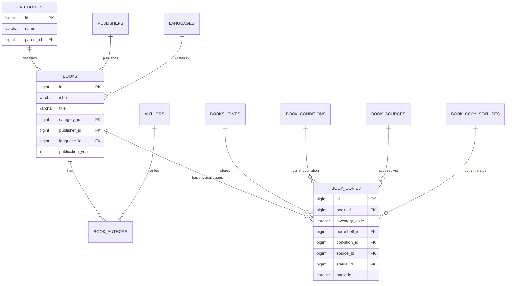
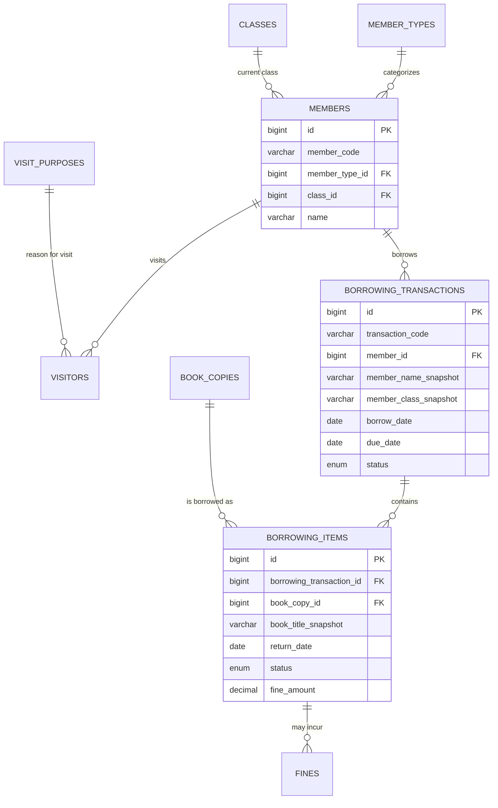
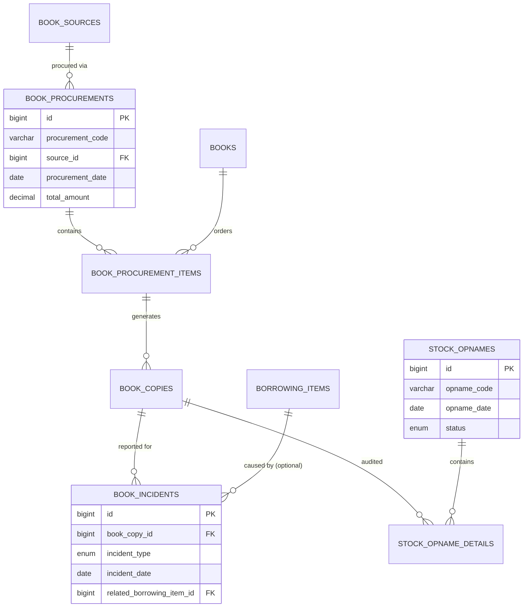

# DATABASE_DESIGN.md

# SIPUS ALIHSAN
## Sistem Informasi Perpustakaan MTs Al-Ihsan Batujajar
### Database Design Document

---

## Document Information

| Field | Value |
|---|---|
| Version | 1.0 |
| Status | Approved |
| Last Updated | July 2026 |
| Related Documents | `CONTRIBUTING_AI.md`, `DECISION_LOG.md` |
| Database Engine | MySQL 8+ (InnoDB, utf8mb4) |
| Companion File | `DATABASE_SQL.sql` |

This document is derived from and must remain consistent with `DECISION_LOG.md`. If a future schema change conflicts with an approved decision, the Decision Log takes precedence and must be amended first (Decision 025, Final Principle).

---

## 1. Purpose & Scope

This document defines the complete relational database structure for SIPUS ALIHSAN: entities, relationships, column definitions, constraints, indexing strategy, and the rationale behind each structural decision. It is the single source of truth for the schema and must be updated whenever the schema changes (Decision 025 — Documentation First).

The schema covers the following domains:

1. **Master Data** — categories, publishers, authors, bookshelves, conditions, sources, statuses, languages, member types, classes, visit purposes.
2. **Bibliographic & Inventory** — Book Master and Book Copies (Decision 008).
3. **People** — Members (Decision 006) and Visitors.
4. **Circulation** — Borrowing, Returning, Fines.
5. **Procurement & Stock Control** — Book Procurement, Stock Opname, Book Incidents (damage/loss).
6. **System** — Users, Roles/Permissions (Spatie), Import Logs, Activity Logs (audit trail), Settings.

---

## 2. Core Design Principles

These principles govern every table in this schema and map directly to `DECISION_LOG.md`.

| # | Principle | Source | Applied As |
|---|---|---|---|
| 1 | Database independence | Decision 004 | No foreign keys to external school systems. Members and books are fully owned by SIPUS. |
| 2 | No live sync with external school data | Decision 005 | Student data enters only via `import_logs`-tracked Excel import into `members`. |
| 3 | Members owned locally | Decision 006 | `members` is a first-class table, not a view or cache. |
| 4 | Transaction snapshot integrity | Decision 007 | `borrowing_transactions` / `borrowing_items` store member name, code, and class **as plain text at time of transaction**, independent of live FK data. |
| 5 | Book Master vs. Book Copies | Decision 008 | `books` (bibliographic) is separate from `book_copies` (physical, one row per physical item). |
| 6 | Dynamic master data, never hardcoded | Decision 009 | Categories, bookshelves, publishers, authors, conditions, sources, copy statuses, member types, visit purposes are all tables, not enums baked into code. |
| 7 | Soft delete over physical delete | Decision 010 | Every master/transactional table carries `deleted_at`. Physical `DELETE` is avoided in application code. |
| 8 | Audit trail on sensitive actions | Decision 019 | `activity_logs` captures create/update/delete/borrow/return/import/export events. |
| 9 | Role-based access via Spatie | Decision 020 | Permission tables are generated by the `spatie/laravel-permission` package migration, not hand-written here (see §9). |
| 10 | 3NF normalization | Decision 023 | No repeating groups; lookups are normalized into their own tables; snapshot fields (Principle 4) are the sole intentional denormalization, and are justified by historical-integrity requirements, not convenience. |
| 11 | Future-proofing (Decision 024) | QR/Barcode, RFID, OPAC, API | `book_copies.barcode` and `members.card_number` exist from v1 even though scanning UI is postponed (Decision 011), so no future migration is needed to add the columns — only to add the scanning workflow. |

---

## 3. Naming Conventions

| Element | Convention | Example |
|---|---|---|
| Table names | `snake_case`, plural | `book_copies`, `borrowing_items` |
| Primary key | `id` (BIGINT UNSIGNED, auto increment) | `id` |
| Foreign key column | `{singular_referenced_table}_id` | `book_id`, `category_id` |
| Foreign key constraint | `fk_{table}_{column}` | `fk_book_copies_book_id` |
| Pivot table | `{table_a_singular}_{table_b_singular}` (alphabetical) | `book_authors` |
| Boolean column | `is_` prefix | `is_active` |
| Snapshot column | `_snapshot` suffix | `member_name_snapshot` |
| Timestamp column | `_at` suffix | `borrow_date` is a DATE, `created_at` is a TIMESTAMP |
| Code/business identifier | `_code` suffix | `member_code`, `inventory_code`, `transaction_code` |

---

## 4. Standard Column Set

Per `CONTRIBUTING_AI.md`, every table that represents a real business entity (master data or transaction) includes the following unless explicitly noted otherwise:

| Column | Type | Notes |
|---|---|---|
| `id` | `BIGINT UNSIGNED` | Primary key, auto increment |
| `created_at` | `TIMESTAMP NULL` | Laravel-managed |
| `updated_at` | `TIMESTAMP NULL` | Laravel-managed |
| `deleted_at` | `TIMESTAMP NULL` | Soft delete (Laravel `SoftDeletes`) — omitted only on pure log tables (§4.1) |
| `created_by` | `BIGINT UNSIGNED NULL` | FK → `users.id` |
| `updated_by` | `BIGINT UNSIGNED NULL` | FK → `users.id` |

### 4.1 Exceptions

Pure, append-only log tables (`activity_logs`, `import_logs`) intentionally **omit** `deleted_at`, `updated_at`, `updated_by`. An audit log that can be edited or soft-deleted is not a trustworthy audit log — immutability is the correct design here, not an oversight. They still carry `created_at` and the acting `user_id`.

Pivot tables (`book_authors`) omit the full audit set and keep only `created_at`, since the parent records already carry ownership/audit data and the relationship itself is not independently reportable.

---

## 5. Status Field Philosophy

Decision 009 says statuses must never be hardcoded. This schema applies that rule with one deliberate distinction:

- **Business/domain statuses** that librarians configure or that carry independent metadata (e.g. a "Rusak Berat" book condition has its own description and future fine-multiplier logic) → **dynamic master table**. Examples: `book_conditions`, `book_copy_statuses`, `book_sources`.
- **Internal workflow states** that are transitions of a state machine owned entirely by the Service layer (e.g. a borrowing transaction moving from `borrowed` → `returned`) → **`ENUM` column**, because these values are never edited by a librarian through a settings screen; changing them is a code change (new workflow step), which should go through migration + code review anyway.

This keeps configurable library policy dynamic (per Decision 009) while keeping application state machines simple and constrained at the database level (an `ENUM` prevents an invalid transaction status from ever being written, which a free-text master-data table cannot guarantee without extra application logic).

---

## 6. Entity Overview by Domain

```
Master Data
├── users
├── languages
├── categories
├── publishers
├── authors
├── bookshelves
├── book_conditions
├── book_sources
├── book_copy_statuses
├── member_types
├── classes
└── visit_purposes

Bibliographic & Inventory
├── books
├── book_authors (pivot)
└── book_copies

People
├── members
└── visitors

Circulation
├── borrowing_transactions
├── borrowing_items
└── fines

Procurement & Stock Control
├── book_procurements
├── book_procurement_items
├── book_incidents
├── stock_opnames
└── stock_opname_details

System
├── import_logs
├── activity_logs
├── settings
└── (roles / permissions — Spatie package tables)
```

---

## 7. Entity Relationship Diagram

### 7.1 Bibliographic & Inventory Domain



### 7.2 People & Circulation Domain



### 7.3 Procurement & Stock Control Domain



---

## 8. Table Dictionary

> Standard columns (`id`, `created_at`, `updated_at`, `deleted_at`, `created_by`, `updated_by`) are listed in §4 and are **not repeated** in every table below unless they deviate from the standard. Only business-specific columns are detailed here.

### 8.1 `users`
Librarian and staff accounts. Roles/permissions attach via Spatie pivot tables.

| Column | Type | Constraints | Description |
|---|---|---|---|
| name | VARCHAR(150) | NOT NULL | Full name |
| email | VARCHAR(150) | NOT NULL, UNIQUE | Login identifier |
| password | VARCHAR(255) | NOT NULL | Bcrypt hash |
| employee_id | VARCHAR(50) | NULL | NIP/staff number |
| phone | VARCHAR(20) | NULL | |
| avatar | VARCHAR(255) | NULL | Path to photo |
| is_active | TINYINT(1) | NOT NULL, DEFAULT 1 | Deactivate instead of delete |
| last_login_at | TIMESTAMP | NULL | |

Self-referencing `created_by`/`updated_by` (nullable) allowed — the first seeded user has NULL creator.

### 8.2 `languages`
| name | VARCHAR(50) | NOT NULL, UNIQUE |
| code | VARCHAR(10) | NULL | e.g. `ID`, `EN`, `AR` |
| is_active | TINYINT(1) | DEFAULT 1 |

### 8.3 `categories`
Supports one level of hierarchy (e.g. Dewey-style groups with sub-groups) via self-referencing `parent_id`.

| name | VARCHAR(150) | NOT NULL |
| code | VARCHAR(20) | NULL | e.g. `200` for Agama |
| parent_id | BIGINT UNSIGNED | NULL, FK → categories.id | |
| description | TEXT | NULL |
| is_active | TINYINT(1) | DEFAULT 1 |

### 8.4 `publishers`
| name | VARCHAR(150) | NOT NULL |
| address | VARCHAR(255) | NULL |
| city | VARCHAR(100) | NULL |
| phone | VARCHAR(20) | NULL |
| email | VARCHAR(150) | NULL |
| is_active | TINYINT(1) | DEFAULT 1 |

### 8.5 `authors`
| name | VARCHAR(150) | NOT NULL |
| biography | TEXT | NULL |
| is_active | TINYINT(1) | DEFAULT 1 |

### 8.6 `bookshelves`
| code | VARCHAR(20) | NOT NULL, UNIQUE | e.g. `RAK-A1` |
| name | VARCHAR(100) | NOT NULL |
| location | VARCHAR(150) | NULL | Physical description |
| capacity | INT UNSIGNED | NULL |
| is_active | TINYINT(1) | DEFAULT 1 |

### 8.7 `book_conditions`
| name | VARCHAR(50) | NOT NULL, UNIQUE | Baik, Rusak Ringan, Rusak Berat, Hilang |
| description | VARCHAR(255) | NULL |
| is_active | TINYINT(1) | DEFAULT 1 |

### 8.8 `book_sources`
| name | VARCHAR(100) | NOT NULL, UNIQUE | Pembelian, Hibah, Bantuan Pemerintah, ... |
| description | VARCHAR(255) | NULL |
| is_active | TINYINT(1) | DEFAULT 1 |

### 8.9 `book_copy_statuses`
| code | VARCHAR(30) | NOT NULL, UNIQUE | `available`, `borrowed`, ... |
| name | VARCHAR(50) | NOT NULL | Tersedia, Dipinjam, ... |
| is_active | TINYINT(1) | DEFAULT 1 |

### 8.10 `member_types`
Drives borrowing policy per Decision 009 (dynamic, not hardcoded).

| name | VARCHAR(50) | NOT NULL, UNIQUE | Siswa, Guru, Staff |
| borrow_limit | INT UNSIGNED | NOT NULL, DEFAULT 2 | Max concurrent borrowed items |
| borrow_duration_days | INT UNSIGNED | NOT NULL, DEFAULT 7 | Default loan period |
| is_active | TINYINT(1) | DEFAULT 1 |

### 8.11 `classes`
Represents current school classes. **Not** referenced by historical transactions (see snapshot fields).

| name | VARCHAR(50) | NOT NULL | e.g. `VII-A` |
| grade_level | VARCHAR(10) | NULL | `VII`, `VIII`, `IX` |
| academic_year | VARCHAR(9) | NULL | `2025/2026` |
| is_active | TINYINT(1) | DEFAULT 1 |

### 8.12 `visit_purposes`
| name | VARCHAR(100) | NOT NULL, UNIQUE | Membaca, Meminjam, Mengembalikan, Tugas, Diskusi |
| is_active | TINYINT(1) | DEFAULT 1 |

### 8.13 `books` (Book Master)
| isbn | VARCHAR(20) | NULL, UNIQUE | Nullable — older/local books may lack ISBN |
| title | VARCHAR(255) | NOT NULL | Indexed |
| subtitle | VARCHAR(255) | NULL |
| category_id | BIGINT UNSIGNED | NOT NULL, FK → categories.id |
| publisher_id | BIGINT UNSIGNED | NULL, FK → publishers.id |
| language_id | BIGINT UNSIGNED | NULL, FK → languages.id |
| publication_year | SMALLINT UNSIGNED | NULL |
| edition | VARCHAR(50) | NULL |
| pages | INT UNSIGNED | NULL |
| call_number | VARCHAR(50) | NULL | Classification/shelf code |
| synopsis | TEXT | NULL |
| cover_image | VARCHAR(255) | NULL | Path |
| is_active | TINYINT(1) | DEFAULT 1 |

### 8.14 `book_authors` (pivot)
| book_id | BIGINT UNSIGNED | NOT NULL, FK → books.id |
| author_id | BIGINT UNSIGNED | NOT NULL, FK → authors.id |
| created_at | TIMESTAMP | NULL |

UNIQUE (`book_id`, `author_id`).

### 8.15 `book_copies` (Book Inventory)
One row per **physical item** (Decision 008).

| book_id | BIGINT UNSIGNED | NOT NULL, FK → books.id |
| inventory_code | VARCHAR(30) | NOT NULL, UNIQUE | e.g. `INV00001` |
| barcode | VARCHAR(50) | NULL, UNIQUE | Reserved for future scanning (Decision 011/024) |
| bookshelf_id | BIGINT UNSIGNED | NULL, FK → bookshelves.id |
| condition_id | BIGINT UNSIGNED | NOT NULL, FK → book_conditions.id | Current physical condition |
| source_id | BIGINT UNSIGNED | NOT NULL, FK → book_sources.id |
| status_id | BIGINT UNSIGNED | NOT NULL, FK → book_copy_statuses.id | Current circulation status |
| procurement_item_id | BIGINT UNSIGNED | NULL, FK → book_procurement_items.id | Traceability to acquisition |
| acquisition_date | DATE | NULL |
| acquisition_price | DECIMAL(12,2) | NULL |
| notes | TEXT | NULL |

### 8.16 `members`
Owned locally (Decision 006), populated by Excel import (Decision 005).

| member_code | VARCHAR(30) | NOT NULL, UNIQUE | Internal SIPUS code |
| nis_nisn | VARCHAR(30) | NULL, INDEX | Student number, from import |
| nip | VARCHAR(30) | NULL, INDEX | Staff number, from import |
| member_type_id | BIGINT UNSIGNED | NOT NULL, FK → member_types.id |
| class_id | BIGINT UNSIGNED | NULL, FK → classes.id | Current class (students only) |
| name | VARCHAR(150) | NOT NULL, INDEX |
| gender | ENUM('L','P') | NULL |
| birth_date | DATE | NULL |
| address | TEXT | NULL |
| phone | VARCHAR(20) | NULL |
| email | VARCHAR(150) | NULL |
| photo | VARCHAR(255) | NULL |
| card_number | VARCHAR(50) | NULL, UNIQUE | Reserved for future barcode/RFID card |
| join_date | DATE | NULL |
| is_active | TINYINT(1) | NOT NULL, DEFAULT 1 |

### 8.17 `visitors`
Guest book. `member_id` nullable to allow non-member guests.

| member_id | BIGINT UNSIGNED | NULL, FK → members.id |
| guest_name | VARCHAR(150) | NULL | Used when member_id is NULL |
| visit_purpose_id | BIGINT UNSIGNED | NOT NULL, FK → visit_purposes.id |
| visit_date | DATE | NOT NULL, INDEX |
| check_in_time | TIME | NULL |
| check_out_time | TIME | NULL |
| notes | VARCHAR(255) | NULL |

### 8.18 `borrowing_transactions` (Header)
One row per borrowing event (a member may borrow several copies at once).

| transaction_code | VARCHAR(30) | NOT NULL, UNIQUE | e.g. `BRW-20260702-0001` |
| member_id | BIGINT UNSIGNED | NOT NULL, FK → members.id |
| member_code_snapshot | VARCHAR(30) | NOT NULL | Frozen at transaction time |
| member_name_snapshot | VARCHAR(150) | NOT NULL | Frozen at transaction time |
| member_class_snapshot | VARCHAR(50) | NULL | Frozen at transaction time |
| member_type_snapshot | VARCHAR(50) | NOT NULL | Frozen at transaction time |
| borrow_date | DATE | NOT NULL, INDEX |
| due_date | DATE | NOT NULL |
| status | ENUM('borrowed','partially_returned','returned','overdue') | NOT NULL, DEFAULT 'borrowed' | Workflow state — see §5 |
| processed_by | BIGINT UNSIGNED | NULL, FK → users.id | Librarian who processed it |
| notes | TEXT | NULL |

### 8.19 `borrowing_items` (Detail)
One row per physical copy within a transaction. This is where returning is recorded.

| borrowing_transaction_id | BIGINT UNSIGNED | NOT NULL, FK → borrowing_transactions.id |
| book_copy_id | BIGINT UNSIGNED | NOT NULL, FK → book_copies.id |
| book_title_snapshot | VARCHAR(255) | NOT NULL | Frozen at borrow time |
| inventory_code_snapshot | VARCHAR(30) | NOT NULL | Frozen at borrow time |
| condition_at_borrow_id | BIGINT UNSIGNED | NOT NULL, FK → book_conditions.id |
| due_date | DATE | NOT NULL | Per-item due date (may differ from header if renewed individually) |
| return_date | DATE | NULL | NULL while still on loan |
| condition_at_return_id | BIGINT UNSIGNED | NULL, FK → book_conditions.id |
| status | ENUM('borrowed','returned','lost','damaged') | NOT NULL, DEFAULT 'borrowed' |
| fine_amount | DECIMAL(12,2) | NOT NULL, DEFAULT 0 | Denormalized total for fast listing; source of truth is `fines` |
| returned_by | BIGINT UNSIGNED | NULL, FK → users.id | Librarian who processed the return |
| notes | TEXT | NULL |

### 8.20 `fines`
Detailed, auditable fine records (supports multiple fine reasons per item and partial payment history).

| borrowing_item_id | BIGINT UNSIGNED | NOT NULL, FK → borrowing_items.id |
| fine_type | ENUM('late','damage','lost') | NOT NULL |
| amount | DECIMAL(12,2) | NOT NULL |
| reason | VARCHAR(255) | NULL |
| status | ENUM('unpaid','paid','waived') | NOT NULL, DEFAULT 'unpaid' |
| paid_amount | DECIMAL(12,2) | NOT NULL, DEFAULT 0 |
| paid_date | DATE | NULL |
| waived_by | BIGINT UNSIGNED | NULL, FK → users.id |
| waived_reason | VARCHAR(255) | NULL |

### 8.21 `book_procurements` (Header)
| procurement_code | VARCHAR(30) | NOT NULL, UNIQUE |
| source_id | BIGINT UNSIGNED | NOT NULL, FK → book_sources.id |
| supplier_name | VARCHAR(150) | NULL |
| invoice_number | VARCHAR(50) | NULL |
| procurement_date | DATE | NOT NULL |
| total_amount | DECIMAL(14,2) | NOT NULL, DEFAULT 0 |
| processed_by | BIGINT UNSIGNED | NULL, FK → users.id |
| notes | TEXT | NULL |

### 8.22 `book_procurement_items`
| procurement_id | BIGINT UNSIGNED | NOT NULL, FK → book_procurements.id |
| book_id | BIGINT UNSIGNED | NOT NULL, FK → books.id |
| quantity | INT UNSIGNED | NOT NULL |
| price_per_unit | DECIMAL(12,2) | NOT NULL |
| subtotal | DECIMAL(14,2) | NOT NULL |

Each accepted item generates `quantity` rows in `book_copies`, each carrying `procurement_item_id` for traceability.

### 8.23 `book_incidents`
Damage and loss reporting, optionally linked to the borrowing event that caused it.

| book_copy_id | BIGINT UNSIGNED | NOT NULL, FK → book_copies.id |
| incident_type | ENUM('damaged','lost') | NOT NULL |
| incident_date | DATE | NOT NULL |
| related_borrowing_item_id | BIGINT UNSIGNED | NULL, FK → borrowing_items.id | NULL if damage found outside a loan (e.g. during stock opname) |
| reported_by | BIGINT UNSIGNED | NULL, FK → users.id |
| description | TEXT | NULL |
| resolution | TEXT | NULL |
| status | ENUM('reported','resolved') | NOT NULL, DEFAULT 'reported' |

### 8.24 `stock_opnames` (Header)
| opname_code | VARCHAR(30) | NOT NULL, UNIQUE |
| opname_date | DATE | NOT NULL |
| status | ENUM('in_progress','completed') | NOT NULL, DEFAULT 'in_progress' |
| conducted_by | BIGINT UNSIGNED | NULL, FK → users.id |
| notes | TEXT | NULL |

### 8.25 `stock_opname_details`
| stock_opname_id | BIGINT UNSIGNED | NOT NULL, FK → stock_opnames.id |
| book_copy_id | BIGINT UNSIGNED | NOT NULL, FK → book_copies.id |
| system_status_id | BIGINT UNSIGNED | NOT NULL, FK → book_copy_statuses.id | Expected status per system records |
| physical_status_id | BIGINT UNSIGNED | NOT NULL, FK → book_copy_statuses.id | Status actually found |
| condition_found_id | BIGINT UNSIGNED | NOT NULL, FK → book_conditions.id |
| notes | VARCHAR(255) | NULL |

### 8.26 `import_logs`
| import_type | ENUM('member','book') | NOT NULL |
| file_name | VARCHAR(255) | NOT NULL |
| total_rows | INT UNSIGNED | NOT NULL, DEFAULT 0 |
| success_rows | INT UNSIGNED | NOT NULL, DEFAULT 0 |
| failed_rows | INT UNSIGNED | NOT NULL, DEFAULT 0 |
| error_details | JSON | NULL |
| imported_by | BIGINT UNSIGNED | NULL, FK → users.id |
| created_at | TIMESTAMP | NULL |

### 8.27 `activity_logs`
Append-only audit trail (Decision 019).

| user_id | BIGINT UNSIGNED | NULL, FK → users.id |
| action | VARCHAR(50) | NOT NULL | `create`, `update`, `delete`, `borrow`, `return`, `import`, `export`, `login`, `logout` |
| module | VARCHAR(100) | NULL | e.g. `books`, `borrowing` |
| description | VARCHAR(255) | NULL |
| model_type | VARCHAR(150) | NULL | Fully qualified model class |
| model_id | BIGINT UNSIGNED | NULL |
| old_values | JSON | NULL |
| new_values | JSON | NULL |
| ip_address | VARCHAR(45) | NULL |
| user_agent | VARCHAR(255) | NULL |
| created_at | TIMESTAMP | NULL |

### 8.28 `settings`
Key-value configuration store (fine per day, default borrow duration overrides, library identity, etc.).

| key | VARCHAR(100) | NOT NULL, UNIQUE |
| value | TEXT | NULL |
| type | VARCHAR(20) | NOT NULL, DEFAULT 'string' | `string`, `integer`, `boolean`, `json` |
| group | VARCHAR(50) | NULL | e.g. `general`, `circulation` |
| description | VARCHAR(255) | NULL |

---

## 9. Roles & Permissions (Spatie)

Per Decision 020, role/permission tables (`roles`, `permissions`, `model_has_roles`, `model_has_permissions`, `role_has_permissions`) are **generated by the `spatie/laravel-permission` package's own migration** (`php artisan vendor:publish --provider="Spatie\Permission\PermissionServiceProvider"` then `php artisan migrate`), not hand-written in `DATABASE_SQL.sql`. Hand-duplicating them risks drifting from the package's expected schema across version upgrades.

Seed roles (to be created via Laravel Seeder, not raw SQL — see §11): `Administrator`, `Head Librarian`, `Librarian`, `Principal` (read-only).

---

## 10. Indexing Strategy

- Every foreign key column is indexed (created automatically by the FK constraint in InnoDB).
- Additional indexes are added on columns used for search/filter in list views: `books.title`, `members.name`, `members.nis_nisn`, `members.nip`, `borrowing_transactions.borrow_date`, `visitors.visit_date`.
- Unique constraints double as indexes: `books.isbn`, `book_copies.inventory_code`, `book_copies.barcode`, `members.member_code`, `members.card_number`, `borrowing_transactions.transaction_code`.
- Composite unique index on `book_authors (book_id, author_id)` prevents duplicate author links.

---

## 11. Important Execution Notes

1. **No user accounts are seeded via raw SQL.** Passwords must be hashed with Laravel's `Hash::make()`. Create the first Administrator via a Laravel Seeder or `php artisan tinker`, never via a plaintext `INSERT` in the SQL script.
2. **Spatie tables are not included** in `DATABASE_SQL.sql` — install the package and run its migration separately, before or after running this script.
3. `DATABASE_SQL.sql` is written to run against an **empty database** and is idempotent (`DROP TABLE IF EXISTS` guards at the top, in dependency-safe order) so it can be re-run during development.
4. All tables use `ENGINE=InnoDB` and `utf8mb4_unicode_ci` for full Unicode (Arabic text in titles/synopses, per the school's Islamic curriculum content) support.

---

## 12. Views

Two convenience views are included in `DATABASE_SQL.sql`:

- **`v_book_availability`** — per-title total copies, available copies, and borrowed copies (feeds the OPAC/search screens without repeated aggregation logic in the app).
- **`v_active_borrowings`** — currently outstanding `borrowing_items` joined with member and book snapshot data, flagged `is_overdue`, for the dashboard's "Late Returns" widget (Decision 016).

---

## 13. Future Expansion Alignment (Decision 024)

| Future Feature | Schema Readiness |
|---|---|
| QR Code / Barcode | `book_copies.barcode`, `members.card_number` already present |
| RFID | Same columns can store RFID tag IDs without a new migration |
| OPAC (public catalog) | `books`, `book_copies`, `v_book_availability` already expose everything needed for a read-only public search |
| REST API | Clean Repository/Service layering (per `CONTRIBUTING_AI.md`) means API Resources can wrap existing models without schema change |
| WhatsApp Notification | `members.phone` already present; a future `notifications` table can be added without touching existing tables |
| Book Reservation | Can be added as a new `book_reservations` table referencing `members` and `books` without modifying existing circulation tables |

---

*End of Document.*
