# Alur Pengerjaan Project SIPUS

Dokumen ini menjadi urutan kerja pembangunan SIPUS dari tahap awal sampai aplikasi siap digunakan. Setiap tahap memiliki tujuan, pekerjaan utama, hasil, dan kriteria selesai.

## Gambaran Alur

```mermaid
flowchart LR
    A[Analisis kebutuhan] --> B[Setup project]
    B --> C[Desain database dan ERD]
    C --> D[Autentikasi dan hak akses]
    D --> E[Master data]
    E --> F[Buku dan inventaris]
    F --> G[Kunjungan]
    G --> H[Peminjaman dan pengembalian]
    H --> I[Denda dan aturan bisnis]
    I --> J[Dashboard dan pencarian]
    J --> K[Laporan dan export]
    K --> L[Testing dan perbaikan]
    L --> M[UAT dan dokumentasi]
    M --> N[Deployment]
    N --> O[Pemeliharaan]
```

## Checklist Progres

Tandai `[x]` setelah kriteria selesai diverifikasi. Tandai `[~]` bila sedang dikerjakan atau masih memiliki blocker.

- [x] Tahap 0 — Ruang lingkup dan keputusan dasar.
- [x] Tahap 1 — Setup project, environment, Laravel, Vue, Inertia, dan TypeScript.
- [x] Tahap 2 — Database, migration, model, dan relasi. Migration sudah dijalankan pada database SIPUS dan seed berhasil.
- [x] Tahap 3 — Autentikasi, role, dan hak akses.
- [x] Tahap 4 — Layout dan komponen UI dasar.
- [x] Tahap 5 — Master data dasar.
- [x] Tahap 6 — Anggota, guru, siswa, dan import XLSX.
- [x] Tahap 7 — Buku, eksemplar, dan inventaris.
- [ ] Tahap 8 — Kunjungan perpustakaan.
- [ ] Tahap 9 — Peminjaman dan pengembalian.
- [ ] Tahap 10 — Denda dan aturan bisnis.
- [ ] Tahap 11 — Dashboard dan pencarian buku.
- [ ] Tahap 12 — Laporan dan export.
- [ ] Tahap 13 — Pengujian.
- [ ] Tahap 14 — User Acceptance Test.
- [ ] Tahap 15 — Dokumentasi dan persiapan rilis.
- [ ] Tahap 16 — Deployment.
- [ ] Tahap 17 — Pemeliharaan.

## Tahap 0 — Menetapkan Ruang Lingkup

### Tujuan

Memastikan fitur dan aturan utama disepakati sebelum kode dibuat.

### Pekerjaan

- Menetapkan role: Admin, Guru, dan Siswa.
- Menetapkan modul utama dan menu tiap role.
- Menetapkan aturan jumlah maksimal pinjaman.
- Menetapkan lama peminjaman guru dan siswa.
- Menetapkan denda keterlambatan, kehilangan, dan kerusakan.
- Menentukan apakah peminjaman hanya diproses Admin atau dapat diajukan anggota.
- Menentukan format nomor anggota, kode buku, kode inventaris, dan kode transaksi.
- Memastikan istilah yang digunakan konsisten: judul buku, eksemplar, anggota, transaksi, dan denda.

### Hasil

- Dokumen rancangan SIPUS.
- [Dokumen ruang lingkup dan keputusan dasar SIPUS](TAHAP-0-RUANG-LINGKUP-SIPUS.md).
- Daftar modul dan prioritas.
- Daftar aturan bisnis yang disepakati.

### Selesai jika

Tidak ada modul utama atau aturan transaksi yang masih ambigu.

## Tahap 1 — Setup Project

### Tujuan

Menyiapkan lingkungan kerja Laravel, Vue, Inertia, TypeScript, dan database.

### Pekerjaan

- Membuat atau clone project Laravel.
- Menyiapkan `.env` dari `.env.example`.
- Mengatur koneksi MySQL atau MariaDB.
- Mengatur nama aplikasi, URL, timezone, locale, session, cache, dan queue.
- Menyiapkan repository Git dan aturan branch.
- Mengatur linting, formatting, dan struktur folder frontend.
- Memastikan Composer, PHP, Node.js, dan NPM tersedia.

### Hasil

- Project dapat dijalankan dengan `php artisan serve`.
- Frontend dapat dijalankan dengan `npm run dev`.
- Database dapat terhubung.

### Selesai jika

Halaman awal Laravel tampil dan perintah build frontend berhasil.

## Tahap 2 — Finalisasi Database dan ERD

### Tujuan

Mengubah rancangan data menjadi migration dan relasi database yang konsisten.

### Pekerjaan

- Meninjau [ERD SIPUS](ERD-SIPUS.md).
- Membuat migration untuk users, members, classes, dan school years.
- Membuat migration untuk books, book copies, authors, publishers, dan book types.
- Membuat migration untuk inventories dan visits.
- Membuat migration untuk loans, loan items, dan fines.
- Membuat migration untuk school settings dan activity logs.
- Menentukan foreign key, unique index, enum atau status, nullable, dan soft delete.
- Menentukan urutan migration berdasarkan dependency.
- Membuat model dan relasi Eloquent.

### Hasil

- Migration lengkap.
- Model dengan relasi.
- Database kosong yang dapat dibuat ulang dengan `php artisan migrate:fresh`.

### Selesai jika

Migration berjalan tanpa error dan seluruh relasi pada ERD terwakili oleh database.

### Checklist Tahap 2

- [x] Migration users disesuaikan dengan akun SIPUS.
- [x] Migration tahun ajaran dan kelas.
- [x] Migration anggota dan relasi akun.
- [x] Migration master buku: jenis, penerbit, pengarang, judul, dan eksemplar.
- [x] Migration inventaris, kunjungan, transaksi, detail transaksi, denda, pengaturan, dan log aktivitas.
- [x] Model dan relasi Eloquent.
- [x] Factory dasar untuk model domain.
- [x] Menjalankan seluruh migration pada database SQLite temporary.
- [x] Memeriksa struktur tabel hasil migration melalui migration run dan PHP lint.
- [ ] Menjalankan migration pada database MySQL kosong khusus SIPUS.
- [ ] Menjalankan smoke test relasi model.

## Tahap 3 — Autentikasi, Role, dan Hak Akses

### Tujuan

Memastikan setiap pengguna hanya dapat mengakses fitur yang sesuai.

### Pekerjaan

- Membuat halaman login dan logout.
- Membuat middleware autentikasi.
- Menetapkan role Admin, Guru, dan Siswa.
- Membuat middleware atau permission untuk membatasi route dan aksi.
- Membuat redirect dashboard sesuai role.
- Membuat halaman profil, ubah username, ubah password, dan ubah foto.
- Membuat reset password admin.
- Menambahkan pencatatan login dan aktivitas penting.

### Hasil

- Pengguna dapat login dan logout.
- Route terlindungi.
- Guru dan siswa tidak dapat membuka halaman admin melalui URL langsung.

### Selesai jika

Pengujian akses membuktikan setiap role hanya melihat menu dan aksi yang diizinkan.

### Checklist Tahap 3

- [x] Halaman login berbasis username.
- [x] Logout dengan invalidasi session dan regenerasi CSRF token.
- [x] Throttle percobaan login.
- [x] Middleware autentikasi dan alias middleware role.
- [x] Pembatasan akses route admin.
- [x] Redirect dashboard setelah login.
- [x] Halaman profil, ubah username, ubah password, dan upload foto.
- [x] Shared props user dan flash message Inertia.
- [x] Feature test login, user nonaktif, route admin, dashboard, dan profile.
- [x] Reset password admin melalui command `php artisan sipus:reset-admin-password`.
- [x] Pencatatan login, logout, perubahan profil, dan reset password admin.

## Tahap 4 — Layout dan Komponen UI Dasar

### Tujuan

Membangun kerangka tampilan yang dipakai seluruh modul.

### Pekerjaan

- Membuat layout sidebar, headbar, dan area konten.
- Membuat sidebar responsif dan hamburger button.
- Membuat breadcrumb, tombol aksi, badge status, modal konfirmasi, dan toast notifikasi.
- Membuat komponen tabel dengan pagination.
- Membuat komponen pencarian, filter, form field, upload file, empty state, loading state, dan error state.
- Menetapkan warna, tipografi, jarak, dan breakpoint responsif.

### Hasil

- Layout utama yang konsisten.
- Komponen UI yang dapat digunakan ulang.

### Selesai jika

Layout nyaman digunakan pada desktop, tablet, dan ponsel.

### Checklist Tahap 4

- [x] Layout utama memiliki sidebar, headbar, dan area konten.
- [x] Sidebar memiliki hamburger button, overlay, dan perilaku responsif.
- [x] Menu sidebar menyesuaikan role Admin, Guru, dan Siswa.
- [x] Breadcrumb halaman dan identitas pengguna tersedia di headbar.
- [x] Komponen tombol, `StatusBadge`, `ConfirmDialog`, dan `AppNotice` tersedia.
- [x] Komponen `DataTable` dan `AppPagination` tersedia untuk modul CRUD.
- [x] Komponen `FormField` dan `FilterBar` tersedia untuk form, pencarian, dan filter.
- [x] Komponen `BusyState`, `EmptyState`, dan `ErrorState` tersedia.
- [x] Warna, tipografi, jarak, breakpoint, dan state hover/focus menggunakan Tailwind.
- [x] Build frontend dan seluruh feature test yang tersedia berhasil dijalankan.

## Tahap 5 — Master Data Dasar

### Urutan

1. Tahun ajaran.
2. Kelas.
3. Jenis buku.
4. Penerbit.
5. Pengarang.

### Pekerjaan tiap modul

- Index dengan pencarian, filter, pagination, dan ringkasan.
- Create, detail, edit, dan hapus atau nonaktifkan.
- Validasi field wajib dan data unik.
- Pencegahan penghapusan data yang masih digunakan.
- Notifikasi berhasil atau gagal.

### Hasil

Master data tersedia untuk dipakai oleh modul buku, anggota, dan laporan.

### Selesai jika

Admin dapat mengelola seluruh master data tanpa memasukkan data langsung melalui database.

### Checklist Tahap 5

- [x] CRUD Tahun Ajaran dengan semester, periode tanggal, status aktif, pencarian, dan pagination.
- [x] CRUD Kelas dengan relasi Tahun Ajaran, wali kelas, status aktif, pencarian, dan pagination.
- [x] CRUD Jenis Buku dengan kode, deskripsi, status aktif, pencarian, dan pagination.
- [x] CRUD Penerbit dengan informasi kontak dan jumlah buku.
- [x] CRUD Pengarang dengan biografi, catatan, dan jumlah buku.
- [x] Tersedia halaman index, tambah, detail, edit, dan hapus untuk setiap master data.
- [x] Validasi field wajib, format input, dan keunikan data diterapkan melalui Form Request.
- [x] Penghapusan dicegah bila data masih dipakai oleh kelas, anggota, atau buku terkait.
- [x] Seluruh route master data dibatasi middleware role `admin`.
- [x] Feature test master data dan validasi akses berhasil: 12 test, 41 assertion.

## Tahap 6 — Anggota, Guru, Siswa, dan Import XLSX

### Tujuan

Menyiapkan pengguna dan anggota yang dapat melakukan transaksi.

### Pekerjaan

- Membuat CRUD siswa.
- Membuat CRUD guru.
- Membuat CRUD akun admin.
- Membuat relasi anggota dengan akun dan kelas.
- Membuat status aktif dan nonaktif.
- Membuat template import XLSX.
- Membuat preview data sebelum import.
- Memvalidasi setiap baris dan menampilkan baris yang gagal.
- Menyediakan export daftar anggota bila diperlukan.

### Hasil

- Data anggota lengkap.
- Akun login dapat dibuat dari data anggota.
- Import massal terdokumentasi.

### Selesai jika

Admin dapat menambah anggota manual maupun melalui XLSX, dan anggota dapat login sesuai role.

### Checklist Tahap 6

- [x] CRUD anggota tersedia untuk siswa dan guru.
- [x] Anggota dapat dihubungkan ke kelas dan akun login.
- [x] Role akun otomatis mengikuti jenis anggota: `siswa` atau `guru`.
- [x] Status aktif/nonaktif anggota dan akun dikelola dari form anggota.
- [x] Validasi nomor anggota, NIS/NIP, username, email, password, dan relasi kelas.
- [x] Download template XLSX anggota tersedia.
- [x] Upload XLSX divalidasi berdasarkan tipe file dan ukuran maksimal.
- [x] Preview import menampilkan baris valid dan pesan kesalahan setiap baris.
- [x] Konfirmasi import hanya menyimpan baris yang valid dalam transaksi database.
- [x] Penghapusan anggota dicegah jika sudah memiliki histori kunjungan atau peminjaman.
- [x] Feature test hak akses, CRUD akun, parsing, preview, dan konfirmasi import berhasil.

## Tahap 7 — Buku, Eksemplar, dan Inventaris

### Tujuan

Membangun pengelolaan koleksi buku fisik dan barang perpustakaan.

### Pekerjaan

- CRUD judul buku.
- Relasi buku dengan jenis, penerbit, dan pengarang.
- CRUD eksemplar buku.
- Pembuatan kode inventaris eksemplar.
- Pengelolaan lokasi rak.
- Pengelolaan kondisi dan status buku.
- Upload cover buku.
- CRUD inventaris non-buku.
- Ringkasan stok, tersedia, dipinjam, rusak, dan hilang.
- Mencegah penghapusan buku yang memiliki histori transaksi.

### Hasil

Katalog dan stok fisik perpustakaan dapat dikelola secara terpisah dan akurat.

### Selesai jika

Admin dapat mengetahui jumlah judul, jumlah eksemplar, lokasi, kondisi, dan status setiap buku.

### Checklist Tahap 7

- [x] CRUD judul buku dengan kode, metadata, jenis buku, penerbit, dan pengarang.
- [x] Relasi buku dengan jenis, penerbit, dan banyak pengarang tersedia.
- [x] Upload cover buku tervalidasi dan disimpan melalui disk publik Laravel.
- [x] CRUD eksemplar buku dengan kode inventaris unik.
- [x] Lokasi rak, kondisi, status, tanggal masuk, dan harga perolehan dikelola.
- [x] Ringkasan jumlah eksemplar dan stok tersedia ditampilkan pada katalog/detail buku.
- [x] CRUD inventaris non-buku dengan jumlah, satuan, lokasi, kondisi, dan status.
- [x] Penghapusan buku dan eksemplar dicegah jika masih memiliki histori peminjaman.
- [x] Seluruh route buku, eksemplar, dan inventaris dibatasi middleware role `admin`.
- [x] Feature test buku, cover, eksemplar, inventaris, penghapusan, dan hak akses berhasil.

## Tahap 8 — Kunjungan Perpustakaan

### Tujuan

Mencatat aktivitas kunjungan dan menyediakan data statistik pengunjung.

### Pekerjaan

- Membuat pencatatan kunjungan oleh Admin.
- Mencatat anggota, waktu masuk, keperluan, dan waktu keluar.
- Menyediakan daftar kunjungan harian dan histori.
- Menambahkan filter tanggal, anggota, kelas, dan keperluan.
- Menampilkan statistik kunjungan harian dan bulanan.

### Hasil

Data kunjungan dapat digunakan pada dashboard dan laporan.

### Selesai jika

Admin dapat mencatat dan mencari kunjungan, sedangkan anggota hanya dapat melihat riwayatnya sendiri.

## Tahap 9 — Peminjaman dan Pengembalian

### Tujuan

Membangun alur transaksi inti SIPUS.

### Pekerjaan peminjaman

- Mencari anggota.
- Memeriksa status anggota dan denda.
- Memeriksa batas jumlah buku.
- Memilih eksemplar yang tersedia.
- Menghitung batas pengembalian.
- Membuat kode transaksi.
- Mengubah status eksemplar menjadi `dipinjam`.
- Menampilkan detail transaksi dan bukti peminjaman.

### Pekerjaan pengembalian

- Mencari kode transaksi atau anggota.
- Menampilkan buku yang belum kembali.
- Memproses pengembalian sebagian atau seluruh transaksi.
- Menghitung keterlambatan.
- Memeriksa kondisi buku saat kembali.
- Mengubah status eksemplar menjadi `tersedia`, `rusak`, atau `hilang`.
- Mengubah status transaksi menjadi `sebagian_kembali` atau `selesai`.

### Hasil

Histori peminjaman dan pengembalian tercatat lengkap.

### Selesai jika

Sistem tidak memungkinkan eksemplar yang sama dipinjam pada dua transaksi aktif.

## Tahap 10 — Denda dan Aturan Bisnis

### Tujuan

Memastikan denda dan batas peminjaman dihitung konsisten.

### Pekerjaan

- Membuat pengaturan lama pinjam per role.
- Membuat pengaturan batas jumlah buku per role.
- Menghitung denda keterlambatan berdasarkan hari.
- Membuat denda buku hilang dan rusak.
- Menampilkan denda pada detail transaksi dan profil anggota.
- Membuat proses pembayaran atau penandaan lunas.
- Mencatat admin yang memproses pembayaran.
- Menentukan apakah denda memblokir peminjaman baru.

### Hasil

Denda, status pembayaran, dan aturan blokir dapat diaudit.

### Selesai jika

Perhitungan denda menghasilkan nilai yang sama untuk kasus uji yang sama dan dapat dijelaskan kepada pengguna.

## Tahap 11 — Dashboard dan Pencarian Buku

### Pekerjaan dashboard Admin

- Total judul dan eksemplar.
- Buku tersedia, dipinjam, rusak, dan hilang.
- Peminjaman hari ini, minggu ini, dan bulan ini.
- Grafik peminjaman dan kunjungan.
- Buku paling sering dan paling jarang dipinjam.
- Aktivitas terbaru.

### Pekerjaan dashboard Guru dan Siswa

- Peminjaman aktif.
- Buku belum kembali.
- Riwayat transaksi.
- Kunjungan bulan berjalan.
- Denda belum lunas.

### Pencarian

- Pencarian judul, kode, ISBN, jenis, pengarang, penerbit, dan lokasi rak.
- Filter kombinasi.
- Hasil menampilkan jumlah eksemplar dan jumlah tersedia.
- Guru dan siswa tidak melihat informasi administrasi internal.

### Selesai jika

Statistik dashboard cocok dengan data transaksi dan hasil pencarian tidak menampilkan data yang tidak berhak dilihat pengguna.

## Tahap 12 — Laporan dan Export

### Pekerjaan

- Laporan peminjaman.
- Laporan pengembalian.
- Laporan keterlambatan dan denda.
- Laporan buku paling sering dan jarang dipinjam.
- Laporan anggota.
- Laporan kunjungan.
- Laporan stok dan kondisi buku.
- Laporan inventaris.
- Filter hari, minggu, bulan, rentang tanggal, kelas, anggota, jenis buku, pengarang, penerbit, dan status.
- Export PDF dan XLSX.
- Menampilkan periode, filter, pembuat, dan waktu laporan.

### Selesai jika

Data export sama dengan data pada layar setelah filter diterapkan dan file dapat dibuka tanpa kerusakan format.

## Tahap 13 — Pengujian

### Pengujian unit

- Perhitungan denda.
- Perhitungan batas pengembalian.
- Perhitungan statistik dashboard.
- Validasi status buku.
- Validasi batas peminjaman.

### Pengujian feature

- Login dan logout.
- Permission tiap role.
- CRUD master data.
- CRUD anggota dan import XLSX.
- CRUD buku dan eksemplar.
- Pencatatan kunjungan.
- Peminjaman dan pengembalian sebagian.
- Denda dan pembayaran.
- Dashboard, pencarian, dan export.

### Pengujian antarmuka

- Desktop.
- Tablet.
- Ponsel.
- Form validasi.
- Loading, empty state, dan error state.
- Navigasi keyboard dan keterbacaan warna.

### Selesai jika

Tidak ada bug kritis, seluruh test utama lulus, dan semua alur role dapat diselesaikan dari antarmuka.

## Tahap 14 — User Acceptance Test

### Skenario utama

1. Admin membuat master data.
2. Admin membuat anggota siswa dan guru.
3. Anggota login.
4. Admin menambahkan judul dan beberapa eksemplar buku.
5. Admin mencatat kunjungan.
6. Admin membuat transaksi peminjaman.
7. Admin mengembalikan satu buku dari transaksi multi-buku.
8. Sistem menghitung denda keterlambatan.
9. Admin menandai denda lunas.
10. Admin membuat laporan dan export PDF/XLSX.

### Hasil

- Daftar temuan UAT.
- Persetujuan dari pengguna perwakilan.
- Daftar perbaikan sebelum rilis.

## Tahap 15 — Dokumentasi dan Persiapan Rilis

### Pekerjaan

- Memperbarui README instalasi.
- Menulis panduan Admin.
- Menulis panduan Guru dan Siswa.
- Menjelaskan import XLSX dan template.
- Menjelaskan backup database.
- Menjelaskan konfigurasi email atau notifikasi jika digunakan.
- Menyiapkan data awal dan akun admin pertama.
- Menyusun changelog.
- Menyiapkan prosedur rollback.

### Selesai jika

Pengguna baru dapat memasang dan menggunakan aplikasi berdasarkan dokumentasi tanpa bantuan teknis untuk langkah rutin.

## Tahap 16 — Deployment

### Sebelum deployment

- Menyiapkan server dan database produksi.
- Mengatur `.env` produksi.
- Menjalankan `composer install --no-dev --optimize-autoloader`.
- Menjalankan `npm ci` dan `npm run build`.
- Menjalankan migration dengan prosedur yang disetujui.
- Mengatur document root ke folder `public`.
- Memastikan `storage` dan `bootstrap/cache` dapat ditulis.
- Mengaktifkan HTTPS.
- Menyiapkan backup otomatis.

### Setelah deployment

- Menjalankan `php artisan config:cache`.
- Menjalankan `php artisan route:cache` jika route mendukung caching.
- Menjalankan `php artisan view:cache`.
- Memeriksa login, dashboard, pencarian, transaksi, export, dan upload.
- Memeriksa log aplikasi.
- Memastikan queue atau scheduler berjalan jika digunakan.

### Selesai jika

Aplikasi dapat diakses pengguna, transaksi uji berhasil, backup tersedia, dan tidak ada error kritis pada log.

## Tahap 17 — Pemeliharaan

- Memantau error aplikasi dan performa database.
- Melakukan backup database dan file upload secara berkala.
- Meninjau log aktivitas dan keamanan akun.
- Memperbarui dependency setelah diuji.
- Menangani bug melalui issue atau daftar pekerjaan.
- Menambahkan fitur melalui migration baru.
- Menguji perubahan di staging sebelum produksi.
- Menjaga dokumentasi tetap sesuai dengan perilaku aplikasi.

## Urutan Prioritas MVP

Jika project perlu dirilis bertahap, gunakan urutan berikut:

1. Login, role, dan layout.
2. Master data anggota, kelas, jenis buku, penerbit, dan pengarang.
3. Buku dan eksemplar.
4. Peminjaman dan pengembalian.
5. Denda dan pengaturan aturan pinjam.
6. Dashboard dasar dan pencarian buku.
7. Kunjungan.
8. Laporan dan export.
9. Inventaris non-buku.
10. Import XLSX, audit log, dan penyempurnaan UX.
