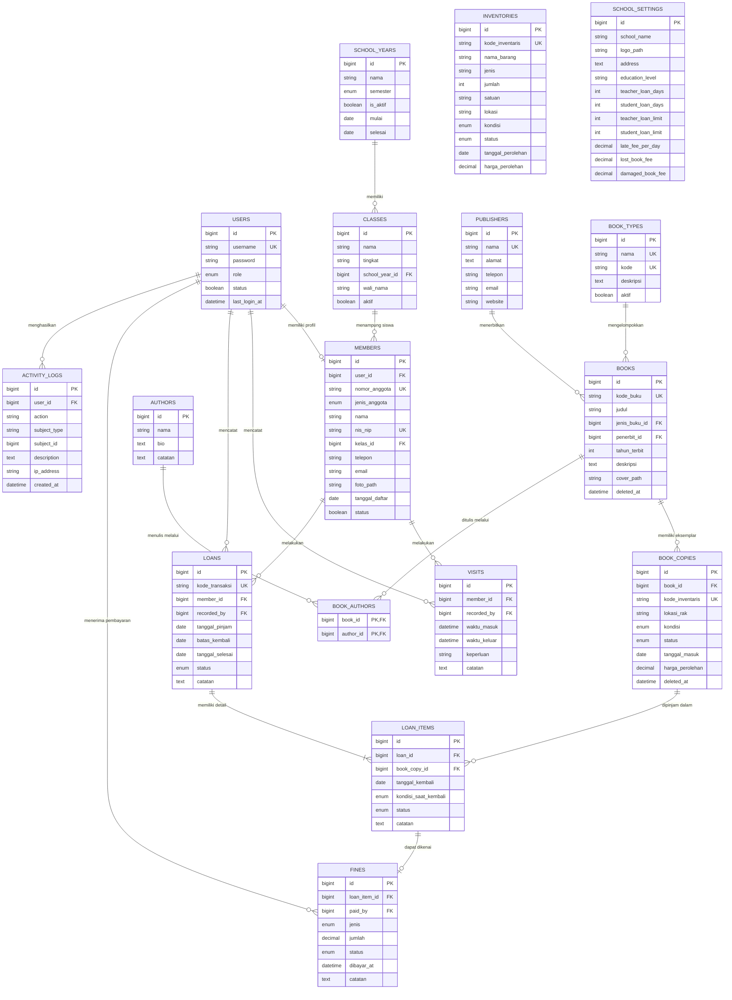

# ERD SIPUS

Entity Relationship Diagram SIPUS berdasarkan rancangan modul, hak akses, dan alur transaksi.

## Relasi Utama

| Relasi | Kardinalitas | Keterangan |
|---|---:|---|
| `users` - `members` | 1 : 0..1 | Akun dapat memiliki satu profil anggota. |
| `school_years` - `classes` | 1 : banyak | Satu tahun ajaran memiliki banyak kelas. |
| `classes` - `members` | 1 : banyak | Satu kelas dapat memiliki banyak siswa. |
| `books` - `book_copies` | 1 : banyak | Satu judul dapat memiliki banyak eksemplar. |
| `books` - `authors` | banyak : banyak | Dikelola melalui `book_authors`. |
| `members` - `loans` | 1 : banyak | Histori peminjaman anggota. |
| `loans` - `loan_items` | 1 : banyak | Satu transaksi dapat memuat beberapa buku. |
| `book_copies` - `loan_items` | 1 : banyak | Satu eksemplar memiliki banyak histori, tetapi satu pinjaman aktif. |
| `loan_items` - `fines` | 1 : 0..1 | Satu detail dapat memiliki satu denda gabungan. |
| `users` - `activity_logs` | 1 : banyak | Perubahan penting dicatat berdasarkan pelaku. |

## Aturan Integritas Data

- `kode_buku`, `kode_inventaris`, `nomor_anggota`, `username`, dan `kode_transaksi` harus unik.
- Eksemplar berstatus `dipinjam` tidak boleh dipakai pada transaksi aktif lain.
- Anggota nonaktif tidak dapat membuat peminjaman baru.
- Data yang memiliki histori transaksi menggunakan soft delete atau status nonaktif.
- `school_settings` umumnya hanya memiliki satu baris konfigurasi aktif.
- Denda disarankan memakai satu arah relasi saja: `fines.loan_item_id`; kolom `fine_id` pada `loan_items` tidak diperlukan pada migration final.

## Catatan Implementasi

Struktur memisahkan judul buku dari eksemplar agar satu judul dapat memiliki beberapa buku fisik dengan kode inventaris, lokasi, kondisi, dan status berbeda. Histori transaksi tetap dipertahankan agar laporan dan perhitungan statistik tidak berubah ketika data master dinonaktifkan.
